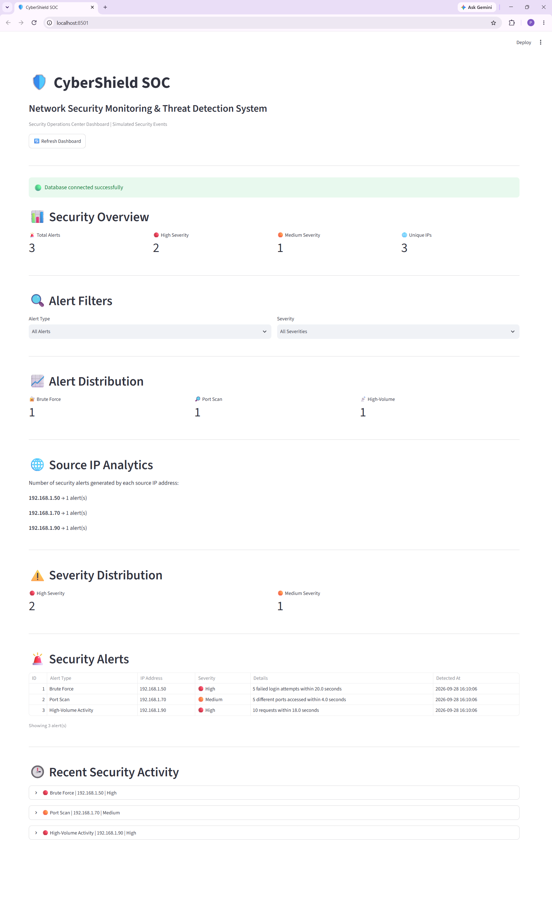

# 🛡️ CyberShield SOC

### Network Security Monitoring & Threat Detection System

CyberShield is a Python-based Security Operations Center (SOC) monitoring system designed to analyze simulated security logs, detect suspicious activities, generate security alerts, store them in MySQL, and visualize them through an interactive Streamlit dashboard.

> **Note:** This project uses simulated security events for educational and portfolio purposes. It does not perform real-world attacks or network scanning.

---

## 🎯 Project Objective

The main objective of CyberShield is to demonstrate how a basic Security Operations Center monitoring workflow can be implemented using Python, MySQL, and Streamlit.

The system:

1. Reads security event logs.
2. Parses individual security events.
3. Analyzes events using detection rules.
4. Identifies suspicious activity.
5. Generates alerts with severity levels.
6. Stores alerts in MySQL.
7. Displays security information through a SOC dashboard.
8. Tests detection logic using automated test cases.

---

## 🚨 Security Threats Detected

### 🔐 1. Brute-Force Detection

Detects repeated failed login attempts from the same IP address.

**Rule:**

```text
5 or more failed login attempts
within 60 seconds
→ Brute Force Alert

## 📊 SOC Dashboard

The Streamlit dashboard provides a simple SOC-style monitoring interface.

### Dashboard Preview

